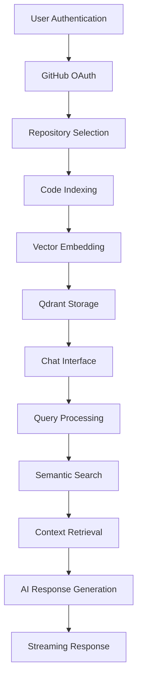

# DevAI 🚀

> **Transform your codebase into an intelligent conversation. DevAI leverages cutting-edge AI to help developers understand, explore, and navigate complex repositories through natural language interactions.**

[](https://github.com/DevAi-FTRI54/DevAi)
[](LICENSE)
[](https://www.typescriptlang.org/)
[](https://reactjs.org/)
[](https://nodejs.org/)

---

## 🚀 What is DevAI?

DevAI revolutionizes how developers interact with codebases by providing an AI-powered chat interface that understands your repository's structure, logic, and patterns. Instead of spending hours manually exploring code, developers can ask natural language questions and receive intelligent, contextual answers with precise file references.

### 🎯 Core Features

- **🤖 AI-Powered Code Understanding**: Advanced RAG (Retrieval-Augmented Generation) architecture with fine-tuned StarCoder models
- **💬 Natural Language Queries**: Ask questions like "How does authentication work?" or "Show me the database models"
- **📍 Precise Context**: Get exact file paths, line numbers, and relevant code snippets
- **🔐 Secure GitHub Integration**: OAuth authentication with GitHub Apps for secure repository access
- **⚡ Real-time Responses**: Streaming AI responses with syntax-highlighted code blocks
- **🎨 Modern Interface**: Clean, responsive UI built with React, TypeScript, and Tailwind CSS
- **💰 Zero Cost**: Built on open-source models - no API fees or subscription costs

---

## 🌐 Getting Started

### Option 1: Use DevAI Web App (Recommended)

The easiest way to experience DevAI is through our hosted web application:

**🔗 Visit [dev-ai.app](https://dev-ai.app)**

1. **Connect Your GitHub**: Secure OAuth authentication
2. **Select Repository**: Choose any public or private repository
3. **Start Chatting**: Ask questions about your codebase instantly

**No setup required. No databases to configure. No costs.**

### Option 2: Self-Hosted Development Setup

For developers who want to run DevAI locally or contribute to the project:

#### Prerequisites

- Node.js 18+ and npm
- GitHub account

#### 1. Clone the Repository

```bash
git clone https://github.com/DevAi-FTRI54/DevAi.git
cd DevAi
```

#### 2. Install Dependencies

```bash
# Install server dependencies
cd server
npm install

# Install client dependencies
cd ../client
npm install
```

#### 3. Environment Setup

Create `.env` files in both `server` and `client` directories:

**Server Environment (`server/.env`)**

```env
# GitHub App Configuration (Required)
GITHUB_APP_ID=your_github_app_id
GITHUB_APP_PRIVATE_KEY_PATH=./config/github-app.pem
GITHUB_CLIENT_ID=your_github_client_id
GITHUB_CLIENT_SECRET=your_github_client_secret

# Authentication
JWT_SECRET=your_jwt_secret_key

# Server Configuration
PORT=4000
NODE_ENV=development
FRONTEND_URL=http://localhost:5173

# Database (if running locally - otherwise we handle this)
MONGODB_URI=mongodb://localhost:27017/devai
QDRANT_URL=http://localhost:6333
```

**Client Environment (`client/.env`)**

```env
VITE_API_BASE_URL=http://localhost:4000
VITE_GITHUB_CLIENT_ID=your_github_client_id
```

#### 4. GitHub App Configuration

To run DevAI locally, you'll need to create a GitHub App:

1. Go to GitHub Settings → Developer settings → GitHub Apps
2. Create a new GitHub App with these permissions:
   - Repository permissions: Contents (Read), Metadata (Read)
   - User permissions: Email (Read)
3. Generate and download the private key
4. Place the private key file in `server/config/github-app.pem`

#### 5. Start the Application

```bash
# Start the backend server
cd server
npm run dev

# In a new terminal, start the frontend
cd client
npm run dev
```

#### 6. Access the Application

- **Frontend**: http://localhost:5173
- **Backend API**: http://localhost:4000

---

## 🏗️ Architecture & Data Flow

DevAI follows a modern microservices architecture with clear separation of concerns:

```
┌─────────────────┐    ┌─────────────────┐    ┌─────────────────┐
│   React Client  │────│  Express API    │────│   GitHub API    │
│   (Frontend)    │    │   (Backend)     │    │   (Data Source) │
└─────────────────┘    └─────────────────┘    └─────────────────┘
                              │
                    ┌─────────▼─────────┐
                    │   AI/ML Pipeline   │
                    │  Vector Database   │
                    │  (Processing)      │
                    └───────────────────┘
```

### Data Flow Diagram

1. **User Authentication**: OAuth flow with GitHub
2. **Repository Selection**: Choose repos through GitHub App installation
3. **Code Ingestion**: Fetch and process repository contents
4. **AI Processing**: Generate embeddings and store in vector database
5. **Query Interface**: Real-time chat with streaming AI responses
6. **Context Retrieval**: Semantic search through embedded code

#### Client Environment (`client/.env`)

```env
VITE_API_URL=http://localhost:4000
VITE_GITHUB_CLIENT_ID=your_github_client_id
```

### 4. Set Up External Services

#### MongoDB Setup

```bash
# Using Docker
docker run -d -p 27017:27017 --name mongodb mongo:latest

# Or install locally
# Follow MongoDB installation guide for your OS
```

#### Qdrant Vector Database Setup

```bash
# Using Docker
docker run -d -p 6333:6333 --name qdrant qdrant/qdrant:latest

# Or install locally
# Follow Qdrant installation guide
```

#### GitHub App Configuration

1. Go to GitHub Settings → Developer settings → GitHub Apps
2. Create a new GitHub App with these permissions:
   - Repository permissions: Contents (Read), Metadata (Read)
   - User permissions: Email (Read)
3. Generate and download the private key
4. Place the private key file in `server/config/github-app.pem`

### 5. Start the Application

```bash
# Start the server (from server directory)
npm run dev

# Start the client (from client directory, in a new terminal)
npm run dev
```

### 6. Access the Application

- Frontend: http://localhost:5173
- Backend API: http://localhost:4000

---

## 🏗️ Architecture Overview

DevAI is built on a modern, scalable architecture that combines multiple cutting-edge technologies:

### 🔧 Technology Stack

#### Frontend

- **React 18** with TypeScript for type-safe component development
- **Tailwind CSS** for responsive, utility-first styling
- **Vite** for fast development and optimized builds
- **React Router** for client-side routing
- **Axios** for API communication

#### Backend

- **Node.js** with TypeScript for server-side logic
- **Express.js** for robust API endpoints
- **MongoDB** with Mongoose for user data and session management
- **Qdrant** vector database for efficient semantic search
- **JWT** for secure authentication and authorization

#### AI/ML Pipeline

- **StarCoder** fine-tuned model for code understanding
- **HuggingFace Transformers** for embedding generation
- **LangChain** for RAG pipeline orchestration
- **OpenAI API** for advanced language model capabilities

### 🔄 System Flow



---

## 📁 Project Structure

```
DevAI/
├── client/                          # React frontend application
│   ├── src/
│   │   ├── components/              # Reusable UI components
│   │   │   ├── auth/                # Authentication components
│   │   │   ├── chat/                # Chat interface components
│   │   │   ├── bars/                # Navigation and sidebar components
│   │   │   └── ingestion/           # Repository ingestion components
│   │   ├── wrappers/                # Page layout wrappers
│   │   ├── types.ts                 # TypeScript type definitions
│   │   └── App.tsx                  # Main application component
│   ├── public/                      # Static assets
│   └── package.json                 # Frontend dependencies
│
├── server/                          # Node.js backend application
│   ├── src/
│   │   ├── features/                # Feature-based modules
│   │   │   ├── auth/                # Authentication logic
│   │   │   ├── indexing/            # Repository indexing system
│   │   │   ├── queries/             # AI query processing
│   │   │   └── chatHistory/         # Chat session management
│   │   ├── models/                  # MongoDB data models
│   │   ├── middleware/              # Express middleware
│   │   ├── config/                  # Configuration files
│   │   └── app.ts                   # Express application setup
│   └── package.json                 # Backend dependencies
│
├── ml/                              # Machine learning components
│   ├── models/                      # AI model configurations
│   ├── scripts/                     # Training and fine-tuning scripts
│   └── requirements.txt             # Python dependencies
│
└── deployment/                      # Deployment configurations
    └── webapp_api_server.py          # Production server setup
```

---

## 🔐 Authentication & Security

DevAI implements enterprise-grade security measures:

### GitHub OAuth Integration

- Secure OAuth 2.0 flow with GitHub
- GitHub App installation for repository access
- Fine-grained permissions (read-only access to code)

### Session Management

- JWT-based authentication
- Secure HTTP-only cookies
- Session invalidation and refresh token rotation

### Data Protection

- Encrypted data transmission (HTTPS)
- Secure environment variable management
- **🔥 HIGHLIGHTED**: Repository data processing with secure storage (Enhanced encryption and vector-only storage planned for Phase 2)

### Planned Security Enhancements (Phase 2)

- **🔥 HIGHLIGHTED**: Advanced encryption for stored code content
- Zero-storage solutions retaining only semantic embeddings
- Enhanced enterprise compliance controls

---

## 🤖 AI/ML Pipeline

### Repository Indexing Process

1. **Code Analysis**: Parse repository structure and identify code files
2. **Intelligent Chunking**: Break code into semantically meaningful chunks
3. **Embedding Generation**: Convert code chunks to vector embeddings
4. **Vector Storage**: Store embeddings in Qdrant for efficient retrieval

### Query Processing Pipeline

1. **Intent Recognition**: Understand user query intent and context
2. **Semantic Search**: Find relevant code chunks using vector similarity
3. **Context Assembly**: Gather relevant code snippets and metadata
4. **Response Generation**: Generate natural language responses with code references
5. **Streaming Delivery**: Stream responses in real-time to the client

### Model Fine-tuning

DevAI uses StarCoder, a specialized code model fine-tuned on:

- Code explanation tasks
- Repository understanding patterns
- Developer question-answering scenarios
- Weekly fine-tuning cycles with updated training data

---

## 🌍 API Documentation

### Authentication Endpoints

```typescript
POST /api/auth/github           # Initiate GitHub OAuth
POST /api/auth/complete         # Complete OAuth flow
GET  /api/auth/user             # Get current user
POST /api/auth/logout           # Logout user
```

### Repository Management

```typescript
GET    /api/repos               # List user repositories
POST   /api/index/ingest        # Start repository indexing
GET    /api/index/status/:jobId # Check indexing status
DELETE /api/repos/:id           # Remove repository
```

### Chat Interface

```typescript
POST /api/query/question        # Submit chat query
GET  /api/chat/history          # Get chat history
POST /api/chat/feedback         # Submit feedback
```

---

## 🧪 Testing

### Running Tests

```bash
# Backend tests
cd server
npm test

# Frontend tests
cd client
npm test

# End-to-end tests
npm run test:e2e
```

### Test Coverage

- **Unit Tests**: Individual component and function testing
- **Integration Tests**: API endpoint and database interaction testing
- **E2E Tests**: Complete user workflow testing
- **AI Pipeline Tests**: Embedding generation and retrieval accuracy testing

---

## 🚀 Deployment

### Production Deployment

#### Using Docker

```bash
# Build and run with Docker Compose
docker-compose up -d
```

#### Manual Deployment

```bash
# Build frontend
cd client
npm run build

# Start production server
cd ../server
npm run build
npm start
```

### Environment Configuration

Ensure production environment variables are set:

- Database connections (MongoDB, Qdrant)
- GitHub App credentials
- JWT secrets
- AI model API keys

---

## 🤝 Contributing

We welcome contributions! Please follow these steps:

### Development Setup

1. Fork the repository
2. Create a feature branch: `git checkout -b feature/amazing-feature`
3. Make your changes and add tests
4. Ensure all tests pass: `npm test`
5. Commit your changes: `git commit -m 'Add amazing feature'`
6. Push to the branch: `git push origin feature/amazing-feature`
7. Open a Pull Request

### Code Style

- Use TypeScript for all new code
- Follow ESLint configuration
- Add JSDoc comments for functions
- Include unit tests for new features
- Maintain 80%+ test coverage

### Areas for Contribution

- 🔧 Additional language support (Python, Java, Go)
- 🎨 UI/UX improvements
- 🚀 Performance optimizations
- 📚 Documentation enhancements
- 🐛 Bug fixes and stability improvements

---

## 📈 Performance & Scalability

### Optimization Features

- **Vector Database**: Qdrant for sub-millisecond semantic search
- **Intelligent Caching**: Redis for frequently accessed data
- **Streaming Responses**: Real-time AI response delivery
- **Code Chunking**: Optimized chunk sizes for better context retrieval
- **Horizontal Scaling**: Microservices architecture for easy scaling

### Monitoring & Analytics

- Response time tracking
- Query accuracy metrics
- User engagement analytics
- System performance monitoring

---

## 🛠️ Troubleshooting

### Common Issues

#### GitHub Authentication Issues

```bash
# Verify GitHub App configuration
# Check callback URLs and permissions
# Ensure private key is correctly formatted
```

#### Vector Database Connection

```bash
# Check Qdrant service status
docker ps | grep qdrant

# Verify connection
curl http://localhost:6333/health
```

#### AI Model Loading Issues

```bash
# Check HuggingFace API key
# Verify model availability
# Monitor GPU memory usage
```

---

## 📊 Roadmap

### Upcoming Features

- **🔥 HIGHLIGHTED**: **Cloud Deployment**: Production infrastructure (Post-launch priority)
- **🔥 HIGHLIGHTED**: **Enhanced Security**: Advanced encryption and zero-storage options (Post-launch priority)
- **Multi-Language Support**: Python, Java, Go, Rust support
- **Team Collaboration**: Shared workspaces and team insights
- **IDE Integration**: VS Code and JetBrains plugins
- **Advanced Analytics**: Code quality metrics and suggestions
- **Custom Model Training**: Organization-specific fine-tuning

### Long-term Vision

- **AI Pair Programming**: Real-time coding assistance
- **Automated Documentation**: AI-generated code documentation
- **Code Review Assistant**: Intelligent code review suggestions
- **Cross-Repository Insights**: Multi-repo pattern analysis

---

## 📄 License

This project is licensed under the MIT License - see the [LICENSE](LICENSE) file for details.

---

## 🙏 Acknowledgments

- **OS Labs** for providing the platform and infrastructure support that made DevAI possible
- **Codesmith Engineering Community** with 100+ active developers serving as our validation user base
- **Open Source Community** for the foundational tools and libraries that power our platform
- **GitHub** for the comprehensive API and developer platform integration
- **HuggingFace** for transformer models and AI infrastructure
- **StarCoder Team** for the specialized code understanding models

---

## 👥 Team

DevAI is built by passionate engineers at OS Labs who understand the challenges of modern software development:

### **Eric Shankman** - Frontend Engineering Lead

- **Focus**: User Experience, Interface Design, Frontend Architecture
- **Expertise**: React, TypeScript, UI/UX Design, Component Architecture
- **Contributions**: Chat interface, responsive design, real-time communication

### **Kyle Headley** - Backend Architecture Lead

- **Focus**: Database Design, Authentication Systems, API Development
- **Expertise**: Node.js, MongoDB, Security Implementation, System Architecture
- **Contributions**: JWT authentication, GitHub App integration, database schema design

### **Marek Bednar** - AI/ML Engineering Lead

- **Focus**: Query Systems, Model Fine-tuning, ML Pipeline Architecture
- **Expertise**: Machine Learning, Vector Databases, AI Model Optimization
- **Contributions**: RAG pipeline implementation, Qdrant integration, StarCoder fine-tuning

---

## 🛠️ Technology Stack

### Frontend Technologies

- **React 18** - Modern component-based UI framework
- **TypeScript** - Type-safe JavaScript for robust development
- **Tailwind CSS** - Utility-first CSS framework for rapid styling
- **Vite** - Fast build tool and development server
- **React Router** - Client-side routing and navigation

### Backend Technologies

- **Node.js** - JavaScript runtime for server-side development
- **Express.js** - Minimal web framework for API development
- **TypeScript** - Type safety for backend development
- **MongoDB** - NoSQL database for user and session data
- **Mongoose** - MongoDB object modeling for Node.js

### AI/ML Technologies

- **StarCoder** - Specialized code understanding model
- **Qdrant** - Vector database for semantic search
- **LangChain** - Framework for RAG pipeline orchestration
- **HuggingFace Transformers** - Pre-trained model ecosystem
- **Vector Embeddings** - Semantic representation of code

### DevOps & Infrastructure

- **GitHub API** - Repository access and OAuth authentication
- **JWT** - Secure authentication and session management
- **Docker** - Containerization for consistent deployments
- **GitHub Actions** - CI/CD pipeline automation
- **ESLint & Prettier** - Code quality and formatting
- **🔥 HIGHLIGHTED**: **Cloud-Native Architecture** - Designed for cloud deployment (Implementation planned post-launch)

---

## 📧 Contact & Support

- **Application**: [dev-ai.app](https://dev-ai.app)
- **Issues**: [GitHub Issues](https://github.com/DevAi-FTRI54/DevAi/issues)
- **Repository**: [GitHub Repository](https://github.com/DevAi-FTRI54/DevAi)

---

<div align="center">

**Experience intelligent code exploration. Experience DevAI.**

[Get Started](https://dev-ai.app) • [Repository](https://github.com/DevAi-FTRI54/DevAi) • Built with ❤️ by OS Labs

</div>
